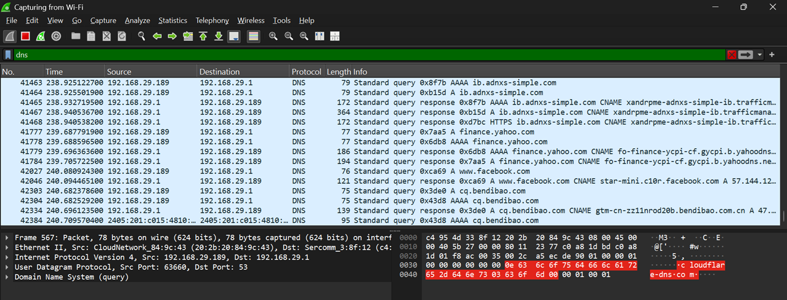
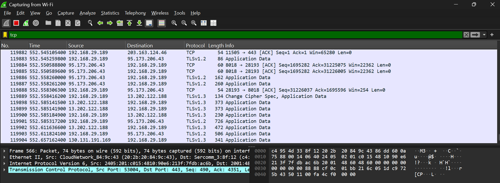
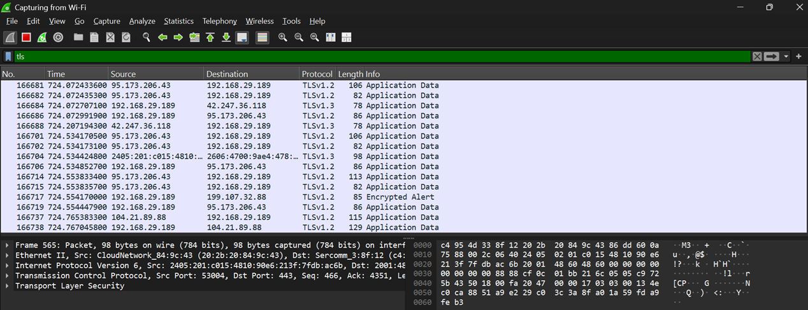
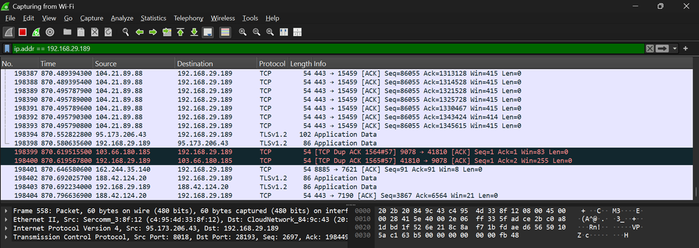
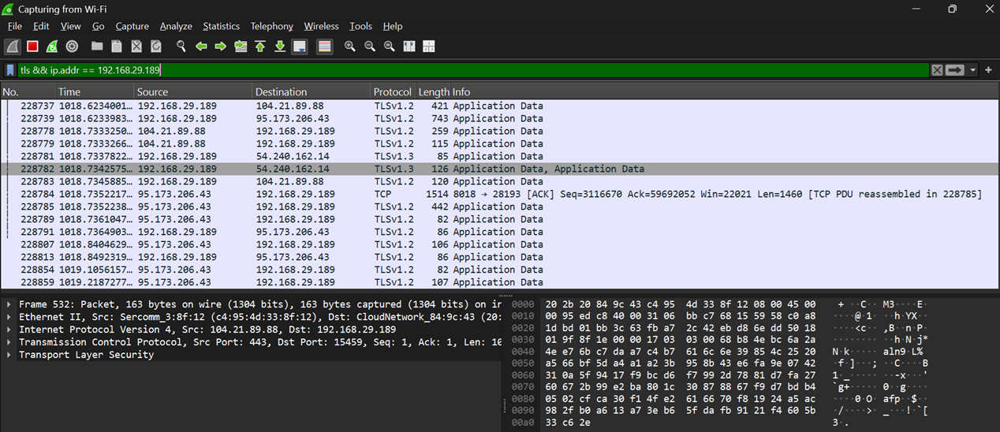

# Display Filter Screenshots

This folder contains screenshots captured while practicing **Wireshark Display Filters** on my local machine.

## DNS Display Filter

**Observation:** Displays only DNS queries and responses made by the system.

---

## TCP Display Filter

**Observation:** Displays TCP communication, including ACK packets and encrypted TLS traffic running over TCP.

---

## TLS Display Filter

**Observation:** Displays encrypted TLS traffic, including TLSv1.2 and TLSv1.3 application data.

---

## IP Address Display Filter

**Observation:** Displays all incoming and outgoing packets involving my host (`192.168.29.189`).

---

## Combined Display Filter

**Observation:** Displays only encrypted TLS traffic associated with my host (`192.168.29.189`).

