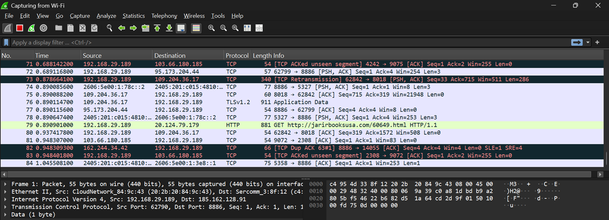
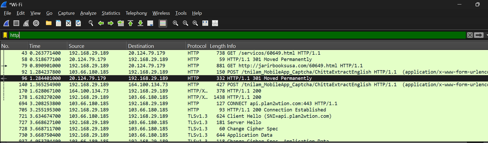
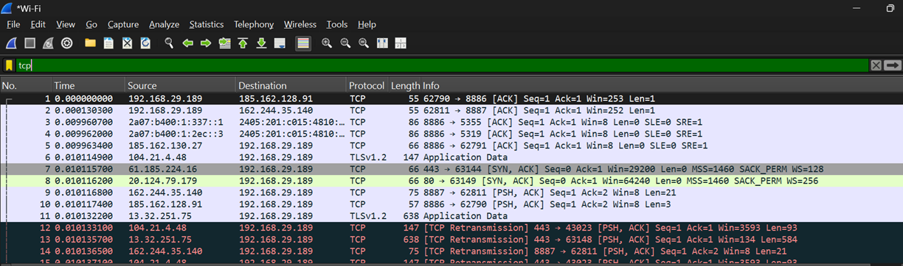
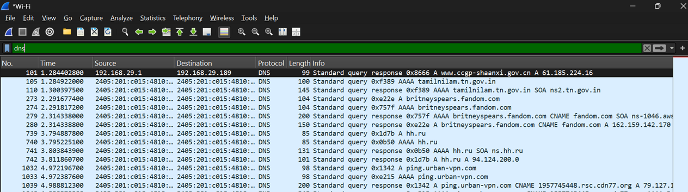
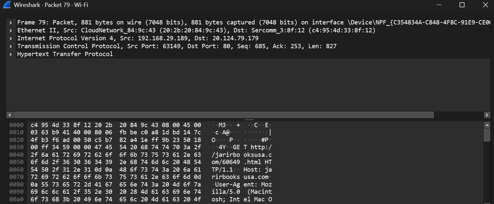

# Screenshots

## Capture Running

### Observation

This screenshot shows Wireshark actively capturing live network traffic on the selected Wi-Fi interface. Multiple protocols such as TCP, TLS, and HTTP can be observed while packets are being captured in real time.

---

## HTTP Display Filter

### Observation

The `http` display filter shows only HTTP packets. In this capture, an HTTP GET request is visible, demonstrating how a client requests a webpage from a web server.

---

## TCP Display Filter

### Observation

The `tcp` display filter displays only TCP packets. It helps analyze reliable communication, including connection establishment, acknowledgements (ACK), retransmissions, and data transfer.

---

## DNS Display Filter

### Observation

The `dns` display filter shows DNS query and response packets. It helps identify how a domain name is resolved into an IP address before communication begins.

---

## HTTP GET Request Details

### Observation

This screenshot shows the details of an HTTP GET request. Expanding the HTTP section reveals information such as the requested resource, host, and HTTP version used by the client.

