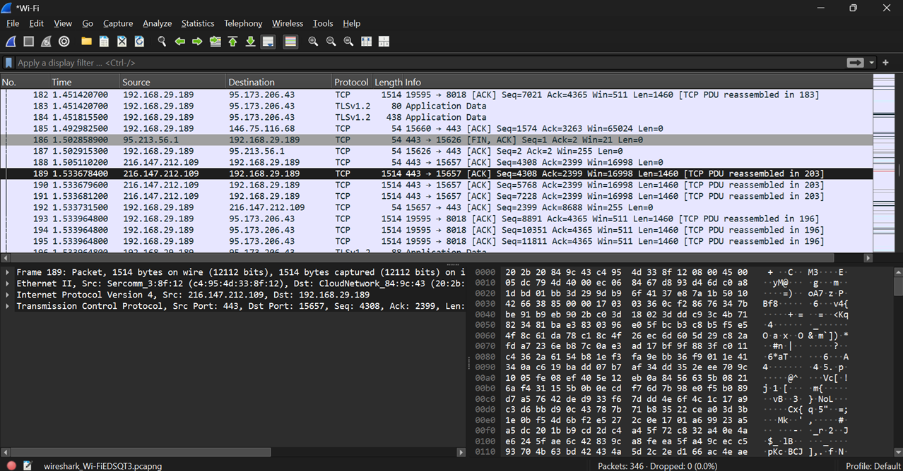
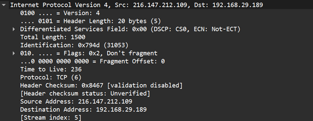
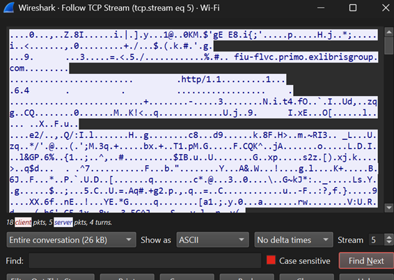
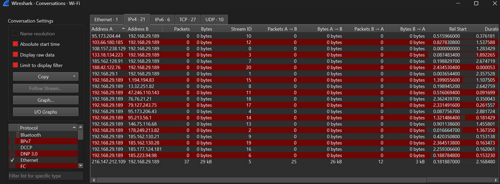
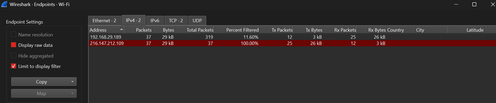
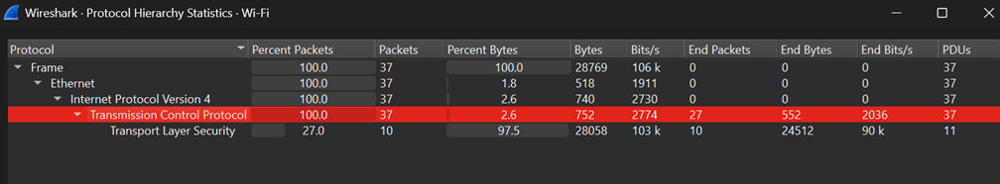

# Screenshots

## Packet Panes

### Observation

This screenshot displays the three primary Wireshark panes: Packet List, Packet Details, and Packet Bytes. Together, they provide a summary of captured packets, detailed protocol information, and the raw hexadecimal representation of the selected packet.

---

## Packet Details

### Observation

This screenshot shows the Packet Details pane with the IPv4 header expanded. It provides detailed information such as the source IP address, destination IP address, Time To Live (TTL), and the encapsulated protocol.

---

## Follow TCP Stream

### Observation

The Follow TCP Stream feature reconstructs the communication between a client and a server. Since the captured traffic uses TLS encryption, the transmitted data appears unreadable without the corresponding decryption keys.

---

## Conversations

### Observation

The Conversations window summarizes communication between pairs of devices. It displays the communicating endpoints, ports used, packet counts, and the amount of data exchanged during each conversation.

---

## Endpoints

### Observation

The Endpoints window lists every individual device that participated in the packet capture. It helps identify hosts on the network along with their packet and byte statistics.

---

## Protocol Hierarchy

### Observation

The Protocol Hierarchy window provides a hierarchical summary of all protocols present in the capture. It helps analysts quickly understand the protocol distribution without inspecting individual packets.

