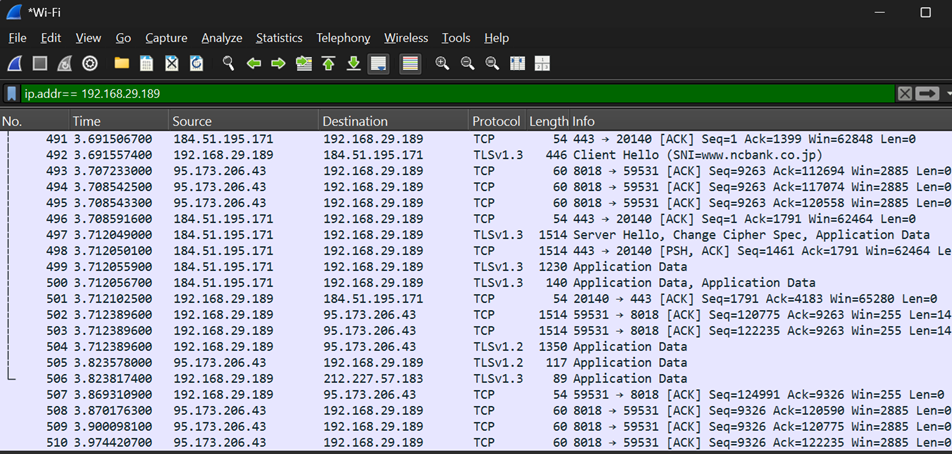
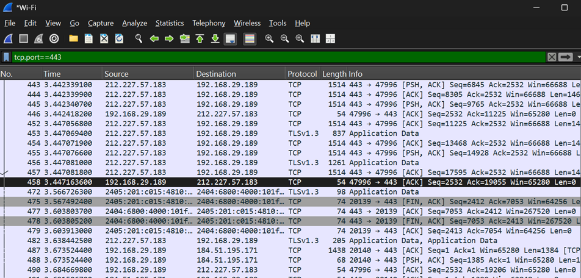
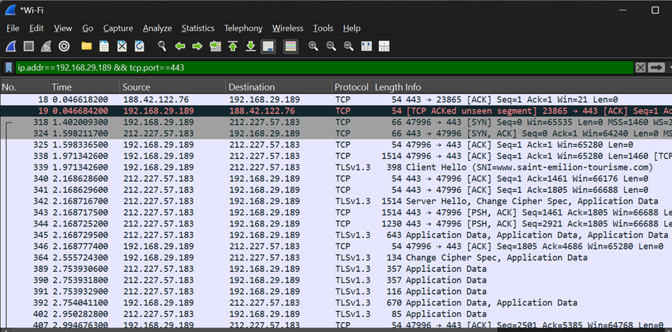
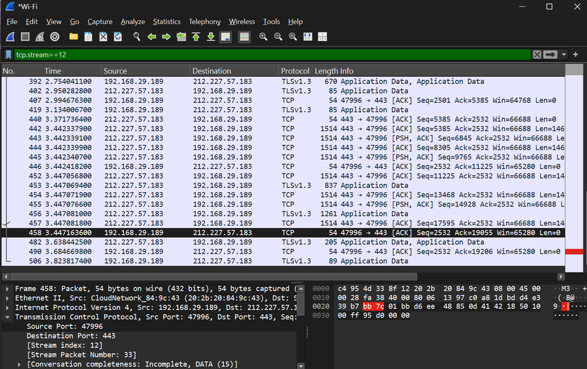
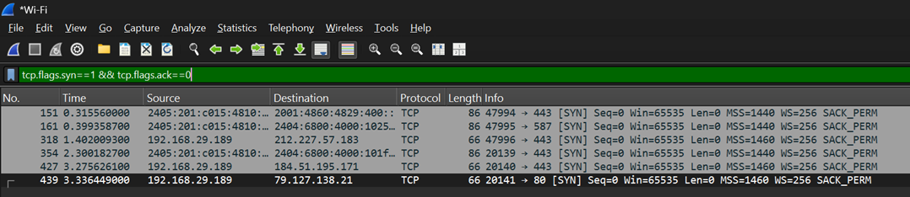
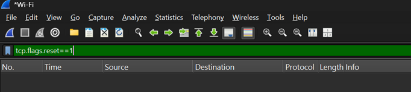

# Screenshots

## IP Address Filter

### Observation

The `ip.addr` display filter shows all packets where the specified IP address appears as either the source or destination. This helps analysts focus on traffic involving a particular host.

---

## HTTPS Port Filter

### Observation

The `tcp.port==443` filter displays all TCP packets using port 443, allowing analysts to examine HTTPS communication between clients and servers.

---

## Combined Filter

### Observation

The combined filter (`ip.addr==<IP> && tcp.port==443`) narrows the results to HTTPS traffic involving a specific host. Combining filters reduces unrelated traffic and speeds up investigations.

---

## TCP Stream Filter

### Observation

The `tcp.stream` filter isolates a single TCP conversation between two endpoints. This makes it easier to analyze the complete lifecycle of one connection without interference from other network traffic.

---

## SYN Packet Filter

### Observation

The `tcp.flags.syn==1 && tcp.flags.ack==0` filter displays only the initial SYN packets that request new TCP connections. It is useful for identifying connection attempts and detecting possible port scanning activity.

---

## RST Packet Filter

### Observation

The `tcp.flags.reset==1` filter displays TCP Reset packets. RST packets indicate that a connection was immediately terminated or rejected. If no packets appear, it simply means no reset packets were present in the captured traffic.

