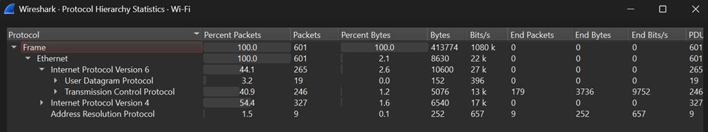
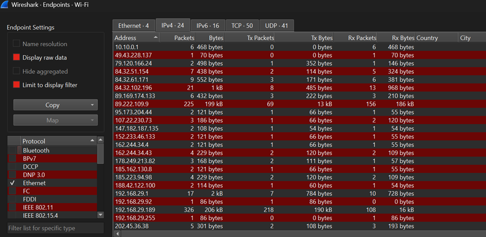
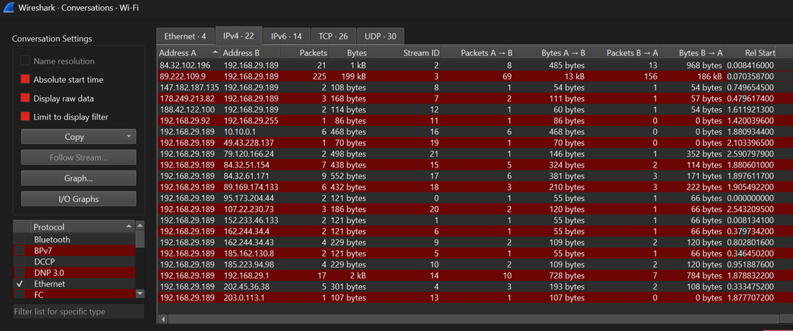
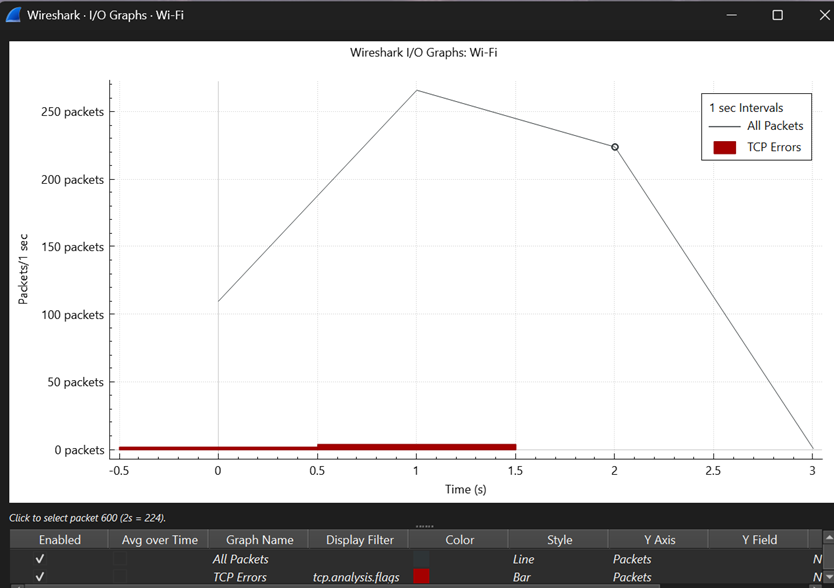
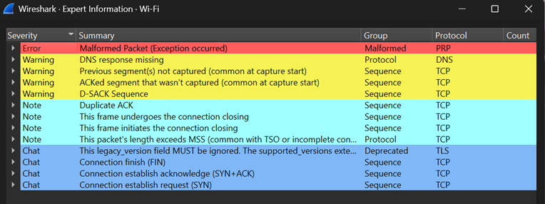

# Screenshots

## Protocol Hierarchy

### Observation

The Protocol Hierarchy window provides a summary of all protocols present in the packet capture. It helps identify which protocols generated the most traffic and gives analysts a quick overview of network activity before inspecting individual packets.

---

## Endpoints

### Observation

The Endpoints window lists every unique device that participated in the capture. It displays useful statistics such as packets, bytes, transmitted packets (Tx), and received packets (Rx), helping analysts identify the most active hosts.

---

## Conversations

### Observation

The Conversations window displays communication sessions between two endpoints. It provides statistics such as packet count, transferred bytes, and conversation duration, making it easier to identify the most significant communications in the capture.

---

## IO Graph

### Observation

The IO Graph visualizes network traffic over time. Peaks represent bursts of network activity, while valleys indicate periods of lower traffic. Analysts use this graph to identify unusual spikes and investigate activity occurring at specific timestamps.

---

## Expert Information

### Observation

The Expert Information window automatically highlights important events detected by Wireshark, including warnings, errors, retransmissions, duplicate acknowledgements, and other noteworthy network conditions. It helps analysts quickly identify areas that may require further investigation.

