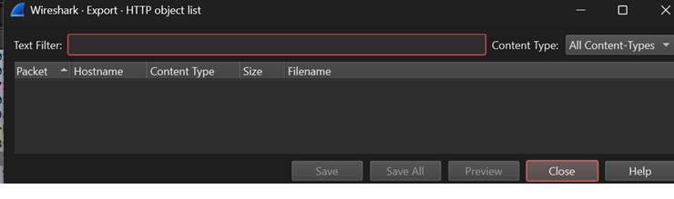
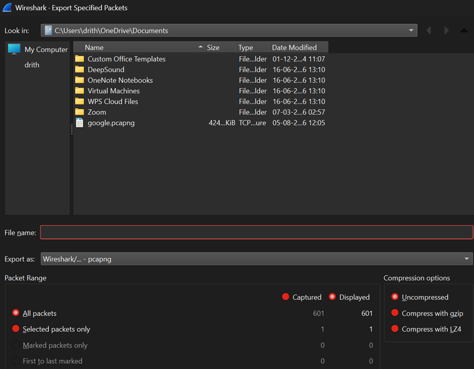
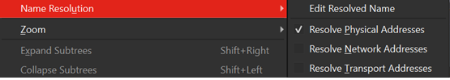
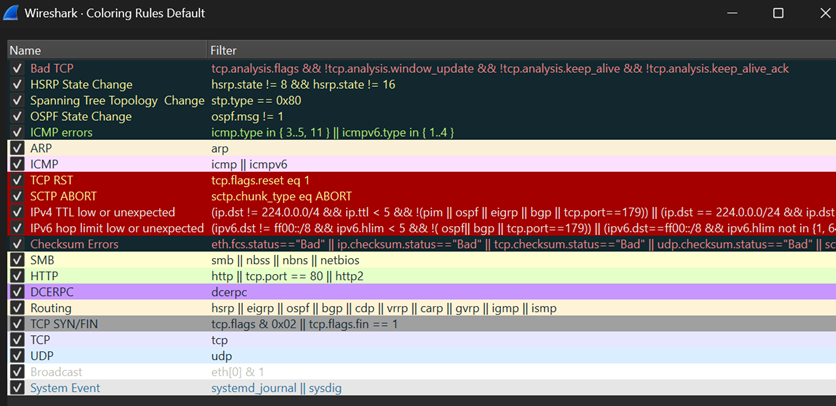
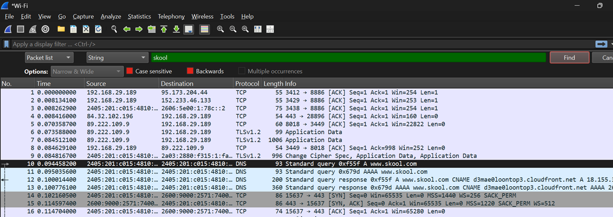
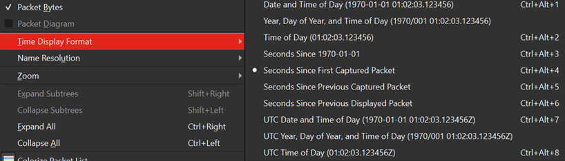

# Screenshots

## Export Objects

### Observation

The Export Objects feature allows analysts to recover files transferred over supported protocols such as HTTP, SMB, FTP, and TFTP. This is useful for examining downloaded files during investigations.

---

## Export Specified Packets

### Observation

The Export Specified Packets window allows exporting all packets, only displayed packets, or marked packets into a new PCAP file. 

---

## Name Resolution

### Observation

Name Resolution replaces IP addresses with human-readable hostnames whenever possible, making packet analysis easier and improving readability.

---

## Coloring Rules

### Observation

Coloring Rules assign different colors to packets based on protocol or predefined conditions, helping analysts quickly identify traffic types and important events.

---

## Find Packet

### Observation

The Find Packet feature searches for packets using strings, display filters, hexadecimal values, or packet numbers, allowing analysts to quickly navigate large captures.

---

## Time Display Format

### Observation

Time Display Format changes how timestamps are shown, making it easier to build timelines and analyze the sequence of network events.

