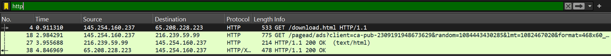
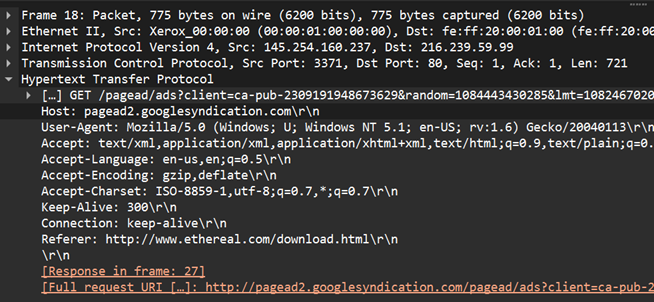
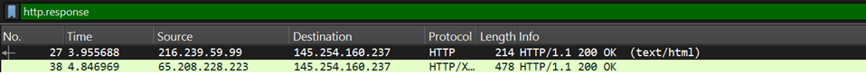
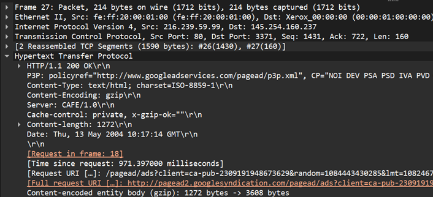
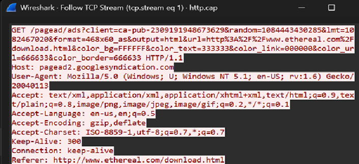
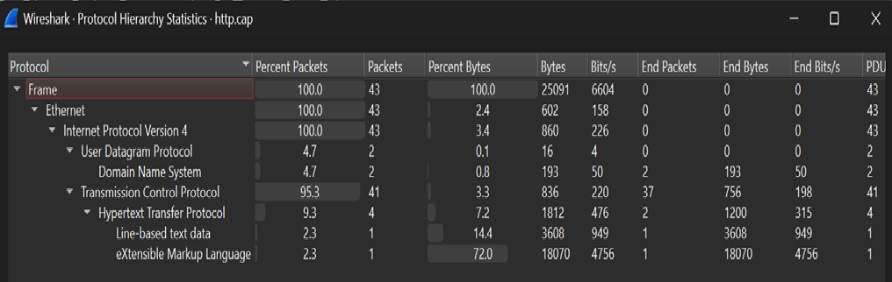

# HTTP Traffic Analysis

## Overview

This lab focuses on analyzing HTTP traffic using Wireshark. The objective is to understand how a web browser communicates with a web server, identify HTTP requests and responses, and reconstruct the communication flow from a packet capture (PCAP) file.


## Scenario

A packet capture containing web browsing activity was provided for analysis.

The goal was to determine:

- Which host was contacted
- What resource was requested
- Whether the request was successful
- What browser generated the traffic
- Whether any suspicious activity was present

---

## Investigation Steps

### Step 1: Filter HTTP Traffic

Applied the following display filter:

```wireshark
http
```

This isolates HTTP packets and removes unrelated traffic such as ARP, DNS, and TCP acknowledgements.

### Evidence



### Findings

- Multiple HTTP requests and responses were observed.
- Web browsing activity was present in the capture.

---

## Step 2: Analyze HTTP GET Request

Selected an HTTP GET request packet and expanded the Hypertext Transfer Protocol section.

### Evidence



### Findings

| Field | Value |
|---------|---------|
| Method | GET |
| Host | pagead2.googlesyndication.com |
| Protocol Version | HTTP/1.1 |
| User-Agent | Mozilla Firefox |
| Referer | www.ethereal.com |

### Why It Matters

The GET request reveals:

- The website contacted by the user
- The browser used
- The resource requested
- The page that initiated the request

This information is frequently used during web traffic investigations.

---

## Step 3: Analyze HTTP Response

Examined the server response corresponding to the GET request.

### Evidence



### Findings

| Field | Value |
|---------|---------|
| Status Code | 200 OK |
| Content Type | text/html |
| Content Encoding | gzip |
| Server | CAFE/1.0 |

### Why It Matters

A status code of:

```http
200 OK
```

indicates that the server successfully processed the request and delivered the requested content.

---

## Step 4: Examine Response Headers

Expanded the HTTP response headers to inspect additional server information.

### Evidence



### Findings

- Content Length information present
- Content Encoding set to gzip
- Server identified as CAFE/1.0

### Why It Matters

HTTP headers provide useful forensic information about:

- Web servers
- File types
- Compression methods
- Content delivery

---

## Step 5: Follow TCP Stream

Used:

```text
Right Click Packet → Follow → TCP Stream
```

to reconstruct the complete communication between client and server.

### Evidence



### Findings

The TCP stream displayed:

- Full HTTP GET request
- Host information
- User-Agent details
- Accept headers
- Referer information

### Why It Matters

TCP Stream reconstruction allows analysts to view application-layer communication in a readable format instead of individual packets.

This is one of the most useful features in Wireshark during investigations.

---

## Step 6: Analyze Protocol Hierarchy

Opened:

```text
Statistics → Protocol Hierarchy
```

to identify all protocols present in the capture.

### Evidence



### Findings

Observed protocols:

- Ethernet
- IPv4
- TCP
- DNS
- HTTP

### Why It Matters

Protocol Hierarchy provides a quick overview of network activity and helps investigators understand what types of communication exist within a capture.

---

## Investigation Summary

### Client Information

| Item | Value |
|---------|---------|
| Client IP | 145.254.160.237 |
| Browser | Mozilla Firefox |

### Server Information

| Item | Value |
|---------|---------|
| Server IP | 216.239.59.99 |
| Host | pagead2.googlesyndication.com |
| Server Header | CAFE/1.0 |

### HTTP Information

| Item | Value |
|---------|---------|
| Method | GET |
| Protocol | HTTP/1.1 |
| Response Code | 200 OK |
| Content Type | text/html |

